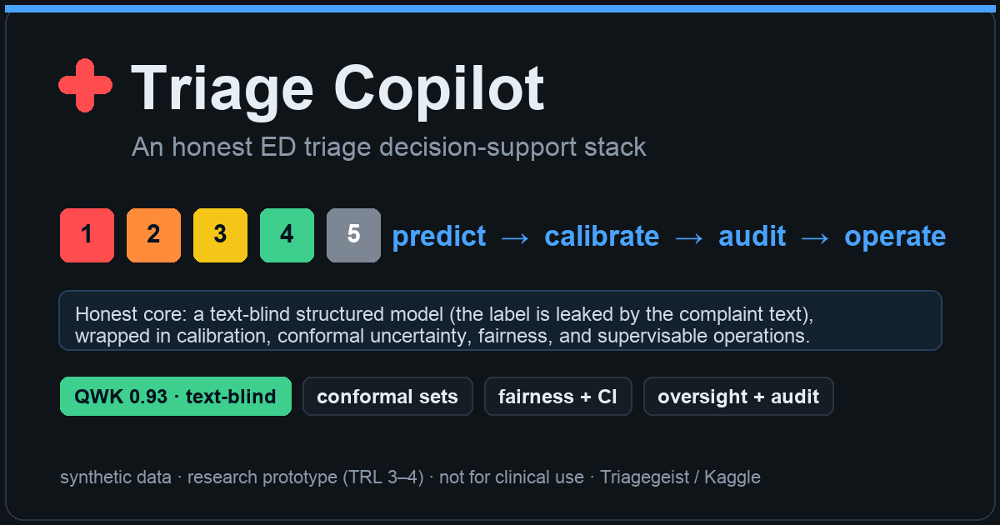
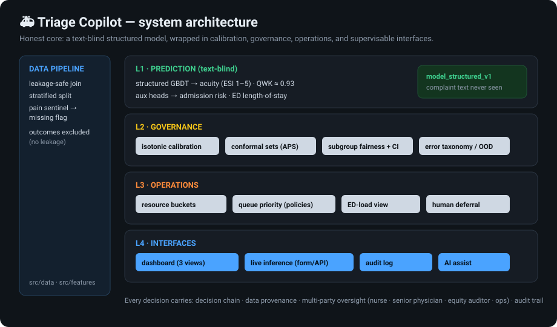
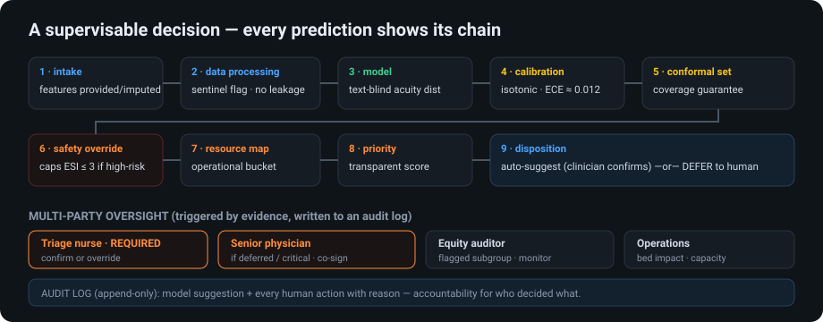
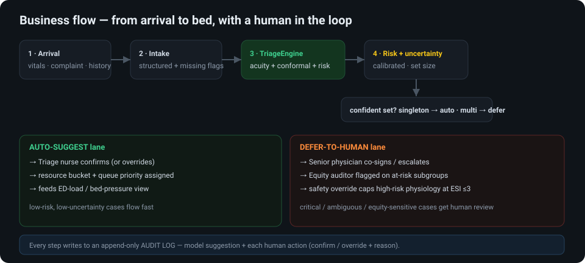
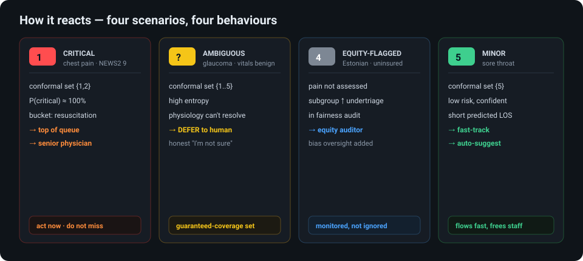
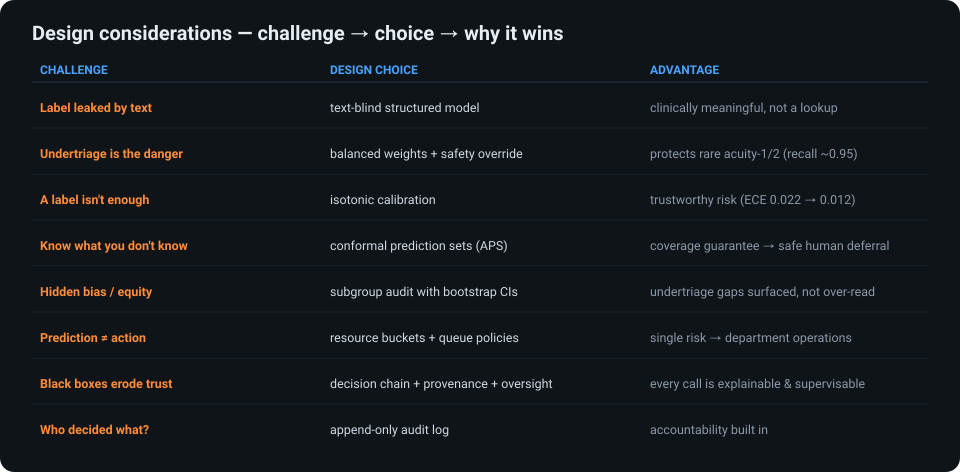

<div align="center">

# Triage Copilot



### An honest emergency-department triage decision-support stack
**predict → calibrate → audit → operate** — every decision shown, supervised, and logged.

`text-blind structured model` · `conformal uncertainty` · `subgroup fairness` · `ED operations console` · `multi-party oversight`

<sub>Built for the [Triagegeist](https://www.kaggle.com/competitions/triagegeist) Kaggle competition · synthetic data · research prototype, **not for clinical use**</sub>

</div>



---

## Why this is different

Most triage-ML projects chase a leaderboard score. We found that in this dataset **the acuity label is a
near-deterministic function of the chief-complaint text** (99.7% of phrases map to one acuity; 99.8% of test
phrases appear verbatim in train) — so a text model scores **QWK ≈ 1.0 and the leaderboard is a lookup table**.

We refuse to pass that off as clinical skill. Instead we build the **clinically honest, text-blind
structured-physiology model (QWK ≈ 0.93)** and invest in the things that actually matter for triage support:
**trustworthy probabilities, characterized failure modes, and a supervisable workflow.**
→ [`reports/INSIGHT_label_leakage.md`](reports/INSIGHT_label_leakage.md)

## A supervisable decision

Every prediction exposes its full chain, its data provenance, and the parties who must review it — and writes
to an append-only audit log.



## How it works · how it reacts
*(full visual deck: [`docs/PRESENTATION.md`](docs/PRESENTATION.md) — data processing, design trade-offs, more)*

**Business flow** — confident cases auto-suggest and flow fast; critical / ambiguous / equity-sensitive cases defer to a human; every step is audit-logged.


**Scenario reactions** — the same engine behaves differently by case:


**Design considerations** — each choice answers a specific clinical or data challenge:


## Capabilities

| Layer | What it does | Status |
|---|---|---|
| **Prediction** | text-blind GBDT acuity (QWK ≈ 0.93) + admission-risk & LOS aux heads | ✅ tested |
| **Calibration** | isotonic OVR — confidence ECE **0.022 → 0.012** | ✅ |
| **Uncertainty** | **split-conformal (APS)** sets with coverage guarantee + human-deferral | ✅ tested |
| **Fairness** | subgroup undertriage with **bootstrap 95% CIs** (language / insurance / pain-missing …) | ✅ |
| **Error analysis** | taxonomy incl. "physiology-silent severe" cases | ✅ |
| **Operations** | resource buckets · queue policies (`safety_first`/`throughput`) · ED-load view | ✅ |
| **Interfaces** | read-only **dashboard** (Queue · Patient · Ops · Audit) + **live inference** form/API | ✅ verified |
| **Governance** | decision trace · data provenance · multi-party oversight · audit log | ✅ |
| LLM assist | offline complaint-normalization + red-flag trace; online Claude/RAG | 🟡 offline only |

`24` Python modules · `12/12` tests green · self-contained Kaggle notebook · static UI.

## Demos (run locally — no data download needed for the UI)

**Dashboard** (4 views, reads a pre-generated feed):
```bash
python -m http.server 8077 --directory app    # → http://localhost:8077
```
- **Queue** — priority-ranked waiting room, policy toggle, risk/uncertainty filters, senior-review flags
- **Patient** — calibrated acuity bars + admission/LOS + **decision chain · data provenance · multi-party oversight**
- **Ops console** — expected admissions, bed pressure, resource mix, per-shift flow
- **Audit log** — model suggestions + human confirm/override actions

**Live inference** (enter a patient → real-time decision, then confirm/override → audit log):
```bash
python -m src.serve.app                        # → http://localhost:8078
```

## Reproduce
```bash
pip install -r requirements.txt
python -m src.data.download        # competition data via kagglehub (Kaggle auth)
python -m src.data.build           # leakage-safe join + stratified split
python -m src.models.gbdt          # text-blind core         → submission.csv (QWK ~0.93)
python -m src.models.fusion        # leakage demonstration    → QWK ~1.0
python -m src.analysis.governance  # calibration + conformal + fairness → reports/governance.md
python -m src.ops.console && python -m src.ops.export_ui     # ops layer + UI feed
python scripts/build_notebook.py   # → notebooks/triagegeist_submission.ipynb
pytest -q                          # 12/12
```

## Honest scope vs mature medical-AI products
This is a **research prototype (≈ TRL 3–4)**, not a deployable device. Mature deployed triage AI
([Mednition KATE](https://mednition.com/), [Aidoc](https://www.aidoc.com/)) is FDA-regulated, EHR/FHIR-integrated,
prospectively validated on real multi-site data, and continuously drift-monitored — none of which is possible
from this synthetic, single-source dataset. What we *do* match is the **trustworthiness discipline** (calibration,
conformal coverage, fairness, explainability, human-in-the-loop) that deployed models like the Epic Sepsis Model
infamously lacked. Full honest gap analysis: [`docs/COMPARISON.md`](docs/COMPARISON.md) · clinical readiness &
governance: [`docs/GOVERNANCE.md`](docs/GOVERNANCE.md).

## Documentation
| Judge-facing | Engineering |
|---|---|
| [`WRITEUP.md`](docs/WRITEUP.md) — rubric-mapped | [`PLAN.md`](docs/PLAN.md) · [`ARCHITECTURE.md`](docs/ARCHITECTURE.md) |
| [`INSIGHT_label_leakage.md`](reports/INSIGHT_label_leakage.md) | [`DATA_DICTIONARY.md`](docs/DATA_DICTIONARY.md) · [`DECISIONS.md`](docs/DECISIONS.md) |
| [`COMPARISON.md`](docs/COMPARISON.md) — vs SOTA/products | [`PROGRESS.md`](docs/PROGRESS.md) |
| [`MODEL_CARD.md`](docs/MODEL_CARD.md) · [`DATA_STATEMENT.md`](docs/DATA_STATEMENT.md) | [`DEMO.md`](docs/DEMO.md) · [`SUBMISSION_CHECKLIST.md`](docs/SUBMISSION_CHECKLIST.md) |

> **Data:** synthetic, non-commercial research use, redistribution prohibited — **not for clinical deployment**.
> The competition data, generated UI feed, and submissions are git-ignored; reproduce via `kagglehub`.
