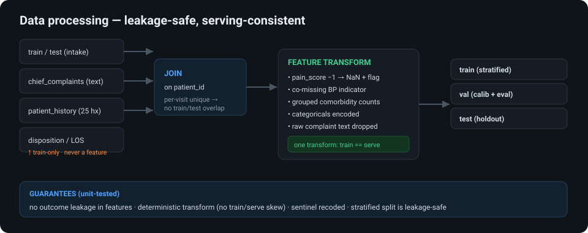
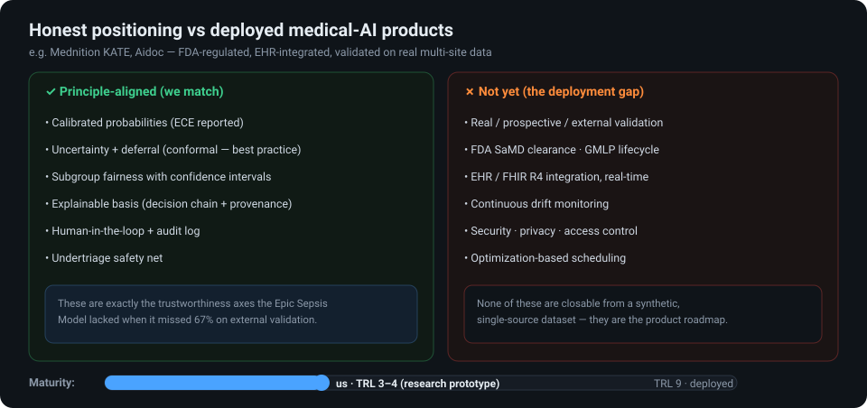

# Triage Copilot — visual introduction

A self-contained visual deck. Each figure stands alone and is embeddable in the notebook / writeup.
Order tells the full story: the insight → the system → the data → the design → a decision → the workflow →
how it reacts → honest positioning.

---

### 0 · Cover

### 1 · The central insight that shapes everything
The acuity label is leaked by the complaint text, so a text model scores ~1.0 (a data property, not skill).
We make the **text-blind structured model** the honest decision core.

### 2 · System architecture
Four layers — prediction → governance → operations → supervisable interfaces — over a leakage-safe data pipeline.

### 3 · Data processing (technical depth)
Four tables joined on `patient_id`; missingness modeled as signal; outcomes blocklisted; one transform for
train **and** serving; guarantees are unit-tested.

### 4 · Design considerations → choices → advantages
Every design decision answers a specific clinical or data challenge.

### 5 · A single supervisable decision
The 9-step decision chain, data provenance, and the multi-party oversight that every prediction carries.

### 6 · Business flow — arrival to bed, human in the loop
Confident cases auto-suggest and flow fast; ambiguous / critical / equity-sensitive cases defer to humans.
Every step is audit-logged.

### 7 · How it reacts — four scenarios, four behaviours
Critical → escalate; ambiguous → honest defer; equity-flagged → bias oversight; minor → fast-track + auto.

### 8 · Honest positioning vs deployed products
Principle-aligned on the trustworthiness axes that matter; infrastructure- and validation-incomplete (TRL 3–4).

---

*Synthetic data · research prototype · not for clinical use. Figures are vector (SVG) / PNG; for Kaggle
writeups that need raster, screenshot or export the SVGs to PNG.*
