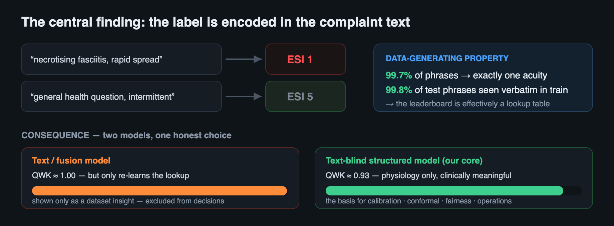
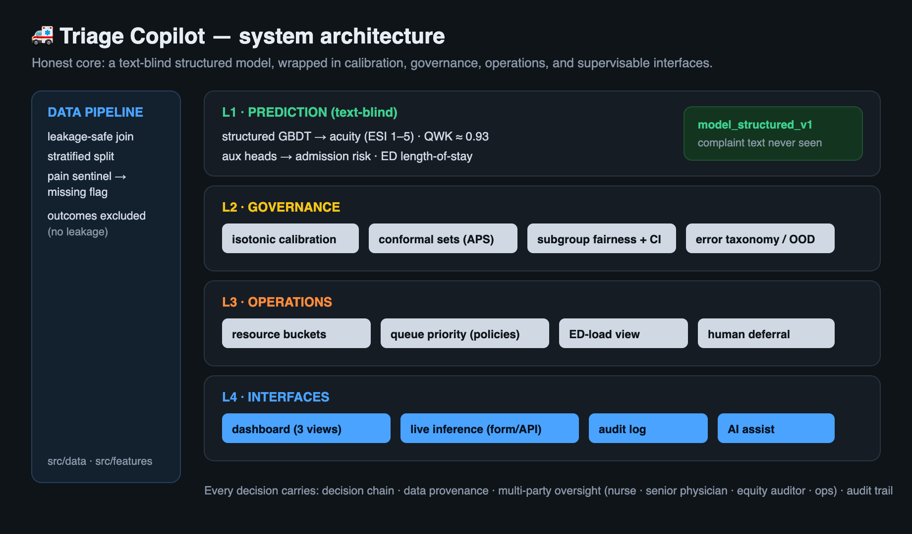
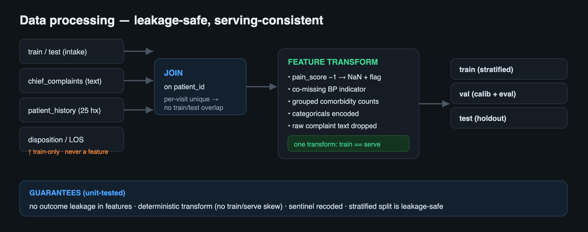
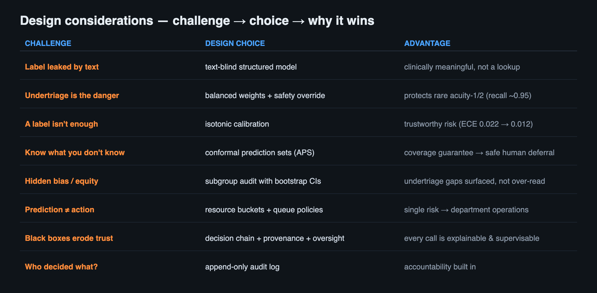
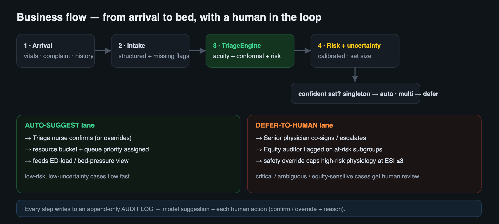
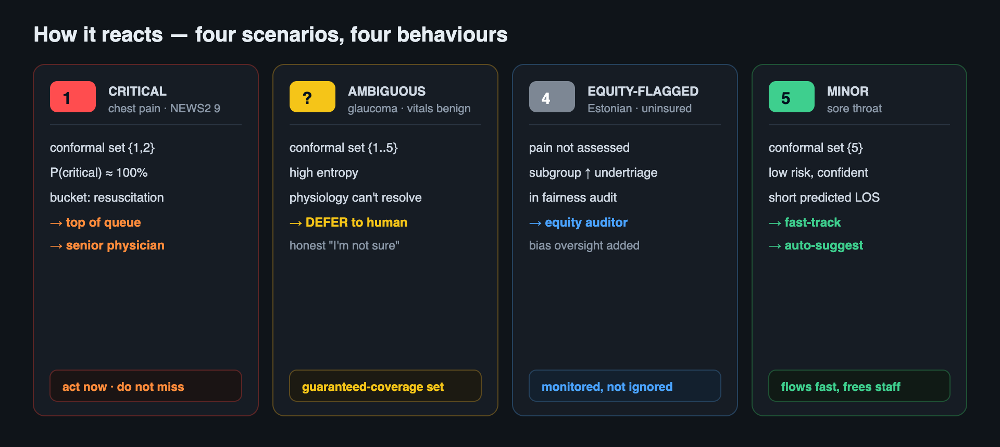
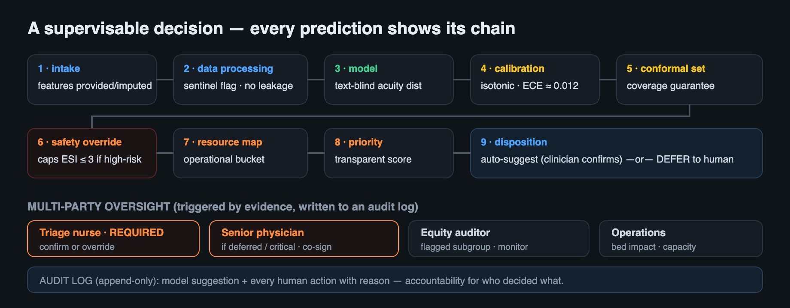
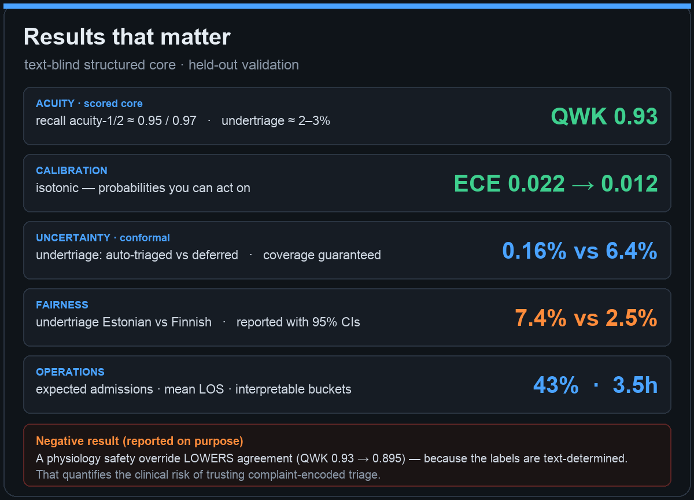
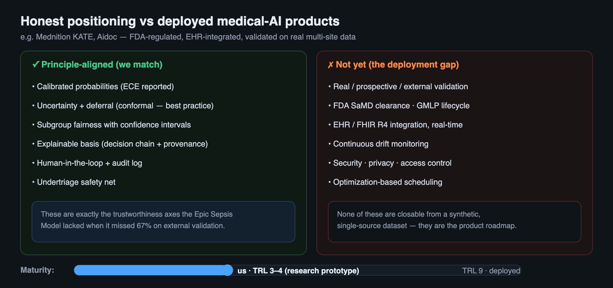

# Triage Copilot — Project Description


## In one minute

**Triage Copilot is an emergency-department triage decision-support system that predicts how urgent a patient
is, explains *why*, and turns that into who-to-see-next and which-bed decisions — with a human always in the
loop.** What makes it different is honesty: we discovered that this competition's acuity label is essentially
*encoded in the chief-complaint text*, so a text model scores a near-perfect leaderboard that means nothing
clinically. Instead of gaming that, we built the clinically meaningful **text-blind model** and surrounded it
with the things a real triage tool needs — calibrated risk, honest uncertainty, fairness checks, an operations
view, and a fully auditable, supervisable workflow.

---

## The problem

In an emergency department, **triage** assigns every arriving patient an acuity level (ESI 1–5) that decides
how fast they're seen and what resources they get. The dangerous mistake is **undertriage** — calling a truly
critical patient "not urgent" — and it tends to fall hardest on vulnerable groups. Triage is also an
**operations** problem: one patient's acuity has to become bed allocation and queue order across a crowded
department.

So a useful triage AI is **not** a leaderboard classifier. It must produce **trustworthy** risk (not just a
label), **protect against undertriage**, **map predictions to actions**, and stay **supervisable** — a
clinician must see the reasoning, be able to override it, and have that recorded.

## What we discovered — and why it shaped the whole project



A quick probe revealed the headline finding: **99.7%** of chief-complaint phrases map to exactly one acuity,
and **99.8%** of test phrases appear verbatim in training. The label is a near-deterministic function of the
text — so a TF-IDF/text model reaches **QWK ≈ 1.0**, but that's a *property of the synthetic data*, not
clinical skill, and the leaderboard is effectively a lookup table.

**Our decision:** make the **text-blind structured-physiology model (QWK ≈ 0.93)** the engine for every
real decision, and report the text model *only* as a dataset insight. This single honest choice is the spine
of the project — it's why the rest of the work (calibration, fairness, operations) is meaningful at all.

## What we built



A four-layer stack over a leakage-safe data pipeline:

- **Prediction** — a text-blind model for acuity, plus admission-risk and length-of-stay heads.
- **Governance** — calibration, **conformal** uncertainty, subgroup fairness, error analysis.
- **Operations** — resource buckets, queue prioritization, ED-load view.
- **Interfaces** — a read-only dashboard, a live-inference form/API, and an audit log.

### Data processing (done carefully)



Four tables are joined on `patient_id`; the `pain = -1` "not assessed" sentinel becomes an explicit
missing-flag (missingness is clinical signal, not noise); outcome columns are blocklisted so they can never
leak into features; and a **single transform** is used for training and serving — verified by unit tests.

## Every design choice answers a real challenge



Nothing here is decoration: label leakage → text-blind model; undertriage danger → balanced weights + a safety
override; "a label isn't enough" → calibration; "know what you don't know" → conformal prediction sets;
hidden bias → subgroup audit with confidence intervals; prediction ≠ action → operational buckets; black
boxes erode trust → a visible decision chain; accountability → an audit log.

## How a patient flows through it



A patient arrives, intake is structured, the engine produces calibrated risk and a conformal set, and the
system **branches**: confident cases **auto-suggest** and flow fast (nurse confirms); ambiguous, critical, or
equity-sensitive cases **defer to a human** (senior physician co-signs, equity auditor watches, safety
override caps high-risk physiology). Every step is written to an append-only audit log.

## How it behaves in real situations



The same engine reacts differently by case — escalate the critical one, **honestly defer** on the ambiguous
one (where physiology genuinely can't resolve the answer), add **bias oversight** on an equity-flagged
patient, and fast-track the minor one. That behaviour *is* the product value.

## Every decision is explainable and supervised



Each prediction exposes its full **decision chain** (9 steps), its **data provenance** (which features were
real vs imputed, plus a no-leakage attestation), and a **multi-party oversight** list that binds the triage
nurse, senior physician, equity auditor, and operations to concrete triggers — all recorded for accountability.

## Results that matter



## Honest about what this is



This is a **research prototype (≈ TRL 3–4)** on synthetic data — **not a clinical device**. It is
*principle-aligned* with deployed products (Mednition KATE, Aidoc) on the trustworthiness axes that matter
most for safety — the very ones the Epic Sepsis Model lacked — but *infrastructure- and validation-incomplete*
(no FDA pathway, EHR/FHIR integration, external validation, or drift monitoring). Stating that plainly is part
of the work.

## Try it / where everything lives

```bash
python -m http.server 8077 --directory app   # dashboard: Queue · Patient · Ops · Audit
python -m src.serve.app                       # live inference: enter a patient → real-time decision
```

- **Notebook (runs end-to-end):** `notebooks/triagegeist_submission.ipynb`
- **Writeup (template):** `docs/WRITEUP_SUBMISSION.md` · **Visual deck:** `docs/PRESENTATION.md`
- **Code:** `src/` · **Reports:** `reports/` · **Repo:** https://github.com/Yanjin-ai/triagegeist

*Synthetic data · non-commercial research use · not for clinical deployment.*
