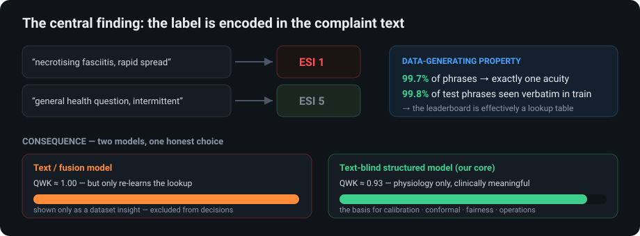

# Triage Copilot — an honest ED triage decision-support stack

*Submission writeup. Companion notebook: `triagegeist_submission.ipynb` (runs end-to-end, public).
Code, interactive prototype, and full reports: GitHub repo linked at the end.*

> **Thesis in one line.** In this dataset the acuity label is a near-deterministic function of the
> chief-complaint text, so a text model scores QWK ≈ 1.0 and the leaderboard is a lookup table. Rather than
> present that as clinical skill, we build the **clinically honest, text-blind structured-physiology model**
> and surround it with calibration, conformal uncertainty, fairness auditing, an operations console, and a
> supervisable, audit-logged decision workflow.


---

## 1. Clinical problem statement

Emergency-department triage assigns each arriving patient an acuity level (ESI 1–5) that governs how quickly
they are seen and what resources they receive. The high-stakes error is **undertriage** — assigning a
*less* urgent level to a genuinely critical patient — and it is both rare and unequally distributed across
patient groups. Triage is also **operational**: an acuity for one patient must translate into bed allocation,
monitoring, and queue order across a crowded department.

A useful triage AI therefore is **not** a leaderboard classifier. It must (a) produce **trustworthy,
calibrated risk**, not just a label; (b) **protect against undertriage**, especially for vulnerable
subgroups; (c) **map predictions to operational actions**; and (d) remain **supervisable** — a clinician must
be able to see why a recommendation was made, override it, and have that recorded. These requirements, not raw
accuracy, define the problem we set out to solve.

The provided data is a synthetic, literature-calibrated Finnish-ED dataset (intake vitals, demographics,
arrival context, comorbidity history, free-text chief complaint; train-only `disposition` and `ed_los_hours`).

## 2. Methodology

**2.1 Leakage-safe data pipeline.** We join four tables on `patient_id`, recode the `pain_score = -1`
"not assessed" sentinel to missing + an explicit `pain_missing` flag (missingness is clinical signal), derive
grouped comorbidity counts, and blocklist the outcome columns so they can never become features. Because
`patient_id` is per-visit-unique with no train/test overlap, a stratified split is leakage-safe. One shared
`transform()` is used for training and serving (no train/serve skew; enforced by tests).

**2.2 The central finding — and the design decision it forces.**
A simple probe showed the acuity label is essentially encoded in the complaint phrase:



- 99.7% of unique complaint phrases map to exactly one acuity; 99.8% of test phrases appear verbatim in train.
- Consequently a TF-IDF/text model reaches QWK ≈ 1.0 — a *property of the data-generating process*, not skill.

We therefore make the **text-blind structured-physiology model** the decision engine (`model_structured_v1`:
vitals, NEWS2/shock-index, demographics, arrival context, comorbidities — never the complaint text). The text
model is reported **only as a dataset insight** and is excluded from every decision surface.

**2.3 Prediction.** An engine-pluggable gradient-boosted model (LightGBM on Kaggle, sklearn
HistGradientBoosting locally — identical logic and seed) predicts acuity with balanced class weights for the
rare, safety-critical class. Two auxiliary heads (admission risk, ED length-of-stay) drive operations.

**2.4 Governance (the part that matters for triage).**
- **Calibration** — isotonic one-vs-rest, with class-wise ECE reported.
- **Uncertainty** — split-conformal **Adaptive Prediction Sets (APS)**: each prediction returns an acuity
  *set* with a distribution-free coverage guarantee; ambiguous (multi-class) sets trigger principled human
  deferral, current best practice for safety-critical clinical AI.
- **Fairness** — subgroup undertriage with **bootstrap 95% CIs** across language, insurance, sex, age, and
  pain-missing, plus an error taxonomy isolating "physiology-silent severe" cases.
- **Safety override** — high-risk physiology (NEWS2 / SpO₂ / GCS) caps the suggestion at ESI ≤3, with the raw
  model value kept visible.

**2.5 Operations.** Predictions map to resource buckets (resuscitation → likely-discharge), a transparent
queue-priority score with `safety_first` / `throughput` policies, and ED-level load aggregates.

**2.6 Supervisable, accountable interfaces.** Every decision exposes its **decision chain** (9 ordered
steps), its **data provenance** (features provided vs imputed, sentinel handling, no-leakage attestation), and
a **multi-party oversight** list binding the triage nurse, senior physician, equity auditor, and operations to
concrete triggers. Decisions and human overrides are written to an **append-only audit log**.


## 3. Results

All numbers are on a held-out internal validation split; the model is the text-blind core.


| Area | Result |
|---|---|
| **Acuity (scored target)** | **QWK ≈ 0.93**, accuracy ≈ 0.85; acuity-1/2 recall ≈ 0.95 / 0.97; undertriage(1,2) ≈ 2–3% |
| **Calibration** | confidence ECE **0.022 → 0.012** (isotonic); class-wise ECE 0.012 → 0.009 |
| **Conformal** | distribution-free coverage held; defers the cases physiology cannot resolve, while the auto-triaged singletons carry **0.16% undertriage vs 6.4% in the deferred set** |
| **Fairness** | undertriage higher for Estonian-speaking (7.4%, CI [2.6–13.2]) and `insurance=unknown` (5.9%) vs Finnish (2.5%); `pain_missing` subgroup QWK degrades to 0.78 |
| **Error taxonomy** | 854/864 errors are off-by-one; only 15 "physiology-silent severe" cases (e.g. *bacterial meningitis*, true acuity 2, normal vitals) |
| **Operations** | cohort: 43% expected admissions, mean LOS 3.5h; interpretable resource-bucket mix and per-shift flow |
| **Insight** | text-blind 0.93 vs text 1.0 — the gap is the *irreducible* part of the label not determined by physiology |

A revealing **negative result**: a physiology-based safety override *lowers* agreement with the synthetic
labels (QWK 0.93→0.895) precisely because the labels are text-determined — quantifying the clinical risk of
trusting complaint-encoded triage, which a real ED would still want guarded.

**Prototype.** An interactive triage copilot (4-view dashboard + live-inference form/API) renders the full
chain, provenance, oversight, and audit log on real held-out cases.

## 4. Limitations (stated plainly)

- **Synthetic, single-source data with label leakage.** The leaderboard is uninformative about clinical
  generalization; the honest QWK ≈ 0.93 has an irreducible ceiling because ~7% of cases are not determined by
  physiology. No real patients, no external/prospective validation.
- **Research prototype (≈ TRL 3–4), not a device.** No FDA/SaMD pathway, no EHR/FHIR integration, no
  continuous drift monitoring, no security/identity/RBAC. We are *principle-aligned* with deployed products
  (Mednition KATE, Aidoc) on calibration/uncertainty/fairness/explainability/human-oversight — the axes the
  Epic Sepsis Model lacked — but *infrastructure- and validation-incomplete*.
- **Operations are heuristic** (transparent weighted priority, not an optimization), and the **LLM assist is
  offline/templated** (online Claude + guideline RAG is a stub).
- **Subgroup signals are one-shot** (with CIs), not continuous monitoring; some groups are small.

## 5. Reproducibility notes

- **Environment:** `requirements.txt` (pinned); Python 3.11+. Data via `kagglehub.competition_download('triagegeist')`
  (the notebook auto-detects `/kaggle/input/triagegeist`). Raw data is git-ignored (redistribution prohibited).
- **Determinism:** fixed seed (42), stratified split, single shared feature transform.
- **One-command pipeline:**
  ```
  python -m src.data.build            # leakage-safe join + split
  python -m src.models.gbdt           # text-blind core → submission.csv
  python -m src.models.fusion         # leakage demonstration (QWK ~1.0)
  python -m src.analysis.governance   # calibration + conformal + fairness → reports/governance.md
  python -m src.ops.console && python -m src.ops.export_ui   # operations + UI feed
  python scripts/build_notebook.py    # regenerate the submission notebook
  pytest -q                           # 12/12 tests (leakage, skew, conformal coverage, ops)
  ```
- **Notebook:** `triagegeist_submission.ipynb` is self-contained, runs end-to-end on Kaggle, set to **public**
  at submission, and writes `submission.csv` in its final cell.
- **Artifacts for review:** `MODEL_CARD.md`, `DATA_STATEMENT.md`, `GOVERNANCE.md`, `COMPARISON.md`,
  `reports/governance.md`, `reports/INSIGHT_label_leakage.md`, reliability figure, and the interactive UI (`app/`,
  `src/serve/`).

*GitHub: https://github.com/Yanjin-ai/triagegeist — synthetic data, non-commercial research use, **not for
clinical deployment**.*
